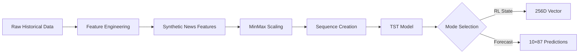

# Stock Trading Bot with TST and RL 

---
## `main.py`: Application Entry Point and Orchestrator

`main.py`는 전체 주식 트레이딩 봇 애플리케이션의 진입점이자 핵심 로직을 통합적으로 관리하는 오케스트레이터 역할을 수행합니다. 사용자 입력부터 최종 트레이딩 조언 출력까지의 전 과정을 자동화된 파이프라인으로 구성합니다.

### 주요 기능 및 처리 흐름

`main.py`의 `run_trading_bot()` 함수를 중심으로 다음과 같은 단계로 작동합니다:

1.  **사용자 입력 수집 (`get_user_input`)**
    *   **목적**: 트레이딩 결정에 필요한 초기 정보를 사용자로부터 받습니다.
    *   **입력**: (애플리케이션 실행 시 CLI 또는 GUI를 통해)
        *   거래 대상 종목 (`ticker`)
        *   현재 주식 보유 상태 (보유 여부, 보유량, 평단가)
        *   사용 가능한 투자금 (`bullet`)
        *   사용자의 거래 의도 (선호 액션: 매수/매도, 의사 강도)
        *   선호하는 RL 에이전트 (`PPO` 또는 `SAC`)
    *   **출력**: 사용자의 입력 정보를 담은 딕셔너리.

2.  **핵심 상태 변수 초기화 (`initialize_state_variables`)**
    *   **목적**: 수집된 사용자 입력을 분석 및 거래 로직에 사용될 내부 상태 변수로 가공합니다.
    *   **입력**: `get_user_input`으로부터 받은 사용자 정보 딕셔너리.
    *   **출력**: 구조화된 현재 상태 정보를 담은 딕셔너리 (예: `current_state`).

3.  **뉴스 데이터 수집 및 감성 분석 (`collect_and_process_news_sentiment`)**
    *   **목적**: 선택된 종목에 대한 최근 뉴스(기본 7일)를 수집하고, 감성 분석을 통해 시장의 심리를 파악합니다.
    *   **가정 의존성**: 
        *   `data_collection.news_fetcher`: 특정 종목의 뉴스를 가져오는 모듈.
        *   `analysis.sentiment_analyzer`: 뉴스 텍스트의 감성을 분석하는 모듈.
        *   `analysis.news_processor`: 분석된 감성 점수를 일별로 집계하는 모듈.
    *   **입력**: 종목 코드 (`ticker`), 분석 기간 (일수).
    *   **출력**: 일별 평균 감성 점수를 담은 Pandas Series (날짜 인덱스).

4.  **기술적 분석 데이터 수집 (`collect_technical_analysis_data`)**
    *   **목적**: 주가 예측 및 RL 에이전트의 상태 구성에 필요한 OHLCV 및 각종 기술적 지표를 수집합니다 (기본 7일).
    *   **가정 의존성**: 
        *   `data_collection.ta_fetcher`: OHLCV 및 기술적 지표를 계산하여 제공하는 모듈.
    *   **입력**: 종목 코드 (`ticker`), 분석 기간 (일수).
    *   **출력**: OHLCV 및 기술적 지표를 포함하는 Pandas DataFrame (날짜 인덱스).

5.  **TST 모델 기반 가격 예측 (`predict_price_with_tst_model`)**
    *   **목적**: 수집된 기술적 데이터와 뉴스 감성 점수를 통합하여 Time Series Transformer(TST) 모델을 통해 향후 주가 움직임을 예측합니다.
    *   **가정 의존성**: 
        *   `models.tst_predictor`: 학습된 TST 모델을 로드하고 예측을 수행하는 모듈.
    *   **입력**: 기술적 분석 데이터 (DataFrame), 일별 감성 점수 (Series).
    *   **출력**: 가격 예측 결과 딕셔너리 (예: 예상 방향, 신뢰도, 예상 변동폭 등).

6.  **RL 에이전트 상태 벡터 구성 (`construct_rl_state_vector`)**
    *   **목적**: 강화학습(RL) 에이전트가 최적의 행동을 결정하는 데 필요한 모든 정보를 집약하여 상태(state) 벡터를 생성합니다.
    *   **입력**: 초기 상태 변수, 기술적 데이터, 일별 감성 점수, TST 가격 예측 결과.
    *   **출력**: RL 에이전트의 입력으로 사용될 상태 벡터 (딕셔너리 형태).

7.  **RL 에이전트를 통한 액션 결정 (`get_action_from_rl_agent`)**
    *   **목적**: 구성된 상태 벡터를 바탕으로 사용자가 선택한 RL 에이전트(PPO 또는 SAC)를 사용하여 최적의 거래 액션(매수, 매도, 관망)을 도출합니다.
    *   **가정 의존성**: 
        *   `agents.ppo_agent`: PPO 알고리즘 기반 RL 에이전트.
        *   `agents.sac_agent`: SAC 알고리즘 기반 RL 에이전트.
    *   **입력**: 상태 벡터, 사용자가 선택한 에이전트 이름.
    *   **출력**: RL 에이전트가 제안하는 액션 및 관련 정보 (예: 이유, 목표 가격 등)를 담은 딕셔너리.

8.  **최종 트레이딩 조언 생성 (`generate_final_recommendation`)**
    *   **목적**: TST 모델의 시장 예측과 RL 에이전트의 행동 결정을 종합하여 사용자에게 이해하기 쉬운 최종 트레이딩 조언을 생성합니다.
    *   **입력**: TST 가격 예측 결과, RL 에이전트의 결정.
    *   **출력**: 사용자에게 제시될 최종 추천 메시지 (문자열).

### 실행 방법

프로젝트 루트 디렉토리에서 다음 명령어를 통해 `main.py`를 실행할 수 있습니다:

```bash
python main.py
```

애플리케이션 실행 시, 콘솔을 통해 필요한 정보(모의 입력 방식 사용 시에는 하드코딩된 값 사용)를 입력받아 전체 분석 및 조언 생성 과정을 수행합니다.

### 모듈 의존성 (가정)

`main.py`는 다음과 같은 주요 모듈(디렉토리)에 의존하는 것으로 가정하고 설계되었습니다. 실제 구현 시 각 모듈 내의 해당 기능들이 개발되어야 합니다.

*   `config/`: 전역 설정 (예: API 키, 지원 티커 리스트)
*   `data_collection/`: 데이터 수집 관련 모듈 (`news_fetcher.py`, `ta_fetcher.py`)
*   `analysis/`: 데이터 분석 관련 모듈 (`sentiment_analyzer.py`, `news_processor.py`)
*   `models/`: 예측 모델 관련 모듈 (`tst_predictor.py`)
*   `agents/`: 강화학습 에이전트 관련 모듈 (`ppo_agent.py`, `sac_agent.py`)

---
## Data Collection Scripts

### Using main.py

프로그램의 진입점인 `main.py`를 통해 데이터 수집을 실행할 수 있습니다.

#### 프로그래매틱 사용
```python
from main import fetch_recent_data, fetch_all_tickers

# 단일 종목 데이터 수집
success = fetch_recent_data("AAPL", days=30)

# 모든 지원 종목 데이터 수집
results = fetch_all_tickers(days=30)
```

#### 커맨드 라인 실행
```bash
# 프로젝트 루트 디렉토리에서 실행
python main.py
```

### ta_fetcher.py

`ta_fetcher.py`는 단일 주식 종목의 최근 30일간의 OHLCV(Open, High, Low, Close, Volume) 데이터와 기술적 지표(Technical Indicators)를 수집하고 계산하는 스크립트입니다.

#### 입력 (Inputs)
- **종목 코드 (Ticker Symbol)**
  - `config/tickers.py`에 정의된 `SUPPORTED_TICKERS` 리스트 내의 종목만 처리 가능
  - 스크립트 내의 `target_ticker` 변수를 수정하여 원하는 종목 선택 (기본값: "AAPL")
- **날짜 범위**
  - 자동으로 계산됨:
    - 종료일(end_date): 스크립트 실행 시점
    - 시작일(start_date): 종료일로부터 30일 전

#### 처리 과정 (Process)
1. **데이터 수집**
   - yfinance API를 통해 지정된 종목의 OHLCV 데이터 수집
   - 설정된 날짜 범위(30일) 동안의 일별 데이터 획득

2. **데이터 전처리**
   - 'Date' 컬럼을 datetime 형식으로 변환
   - DatetimeIndex로 설정하여 시계열 데이터 구조 생성

3. **기술적 지표 계산**
   - `feature_engineering/ta_calculator.py`의 `calculate_technical_indicators` 함수 사용
   - OHLCV 데이터를 기반으로 다양한 기술적 지표 계산
   - 원본 OHLCV 데이터도 포함 (include_ohlcv=True)

#### 출력 (Outputs)
- **CSV 파일**
  - 파일명: `{종목코드}_last_30days_features.csv` (예: `AAPL_last_30days_features.csv`)
  - 포함 데이터:
    - 인덱스: Date (날짜)
    - 컬럼: 
      - OHLCV (Open, High, Low, Close, Volume)
      - 계산된 모든 기술적 지표들

#### 실행 방법
```bash
# 프로젝트 루트 디렉토리에서 실행
python data_collection/ta_fetcher.py
```

#### 주의사항
- 스크립트는 반드시 프로젝트 루트 디렉토리에서 실행해야 합니다
- 스크립트는 `config/tickers.py`에 정의된 종목만 처리 가능
- 다른 종목을 처리하려면 스크립트 내의 `target_ticker` 값을 수정해야 함
- `feature_engineering/ta_calculator.py` 모듈이 필요하며 Python 경로에서 접근 가능해야 함
- 실행 시점으로부터 30일 전의 데이터만 처리됨

---

## News Processor (`news_processor.py`)

### 개요

`feature_engineering/news_processor.py`는 뉴스 감성 분석 결과를 일별 특성으로 집계하는 핵심 모듈입니다. 개별 헤드라인의 감성 점수를 일별로 통합하고, 주말 뉴스의 영향을 다음 주 영업일에 전파하는 고급 기능을 제공합니다.

### 주요 기능

#### 1. **일별 감성 집계**
- 개별 뉴스 헤드라인의 감성 점수를 일별로 평균화
- 하루 내 여러 뉴스가 있을 경우 감성 점수 통계 처리
- 뉴스 개수 카운팅으로 시장 관심도 측정

#### 2. **주말 효과 모델링**
- 주말 발행 뉴스의 감성이 다음 주 영업일에 미치는 영향 정량화
- 토요일/일요일 뉴스 → 다음 주 월~금요일 5영업일에 효과 전파
- 복수 주말 뉴스 시 평균 효과 계산

#### 3. **영업일 기반 처리**
- 미국 증시 영업일 (월~금) 기준으로 데이터 정렬
- 주말/공휴일 제외 처리
- 영업일 시퀀스 자동 생성

### 핵심 함수 분석

#### `is_us_business_day(dt_date: date) -> bool`
```python
def is_us_business_day(dt_date: date):
    # Monday(0) to Friday(4)
    return dt_date.weekday() < 5
```
- **목적**: 해당 날짜가 미국 영업일인지 판단
- **기준**: 월요일(0) ~ 금요일(4)
- **제한**: 연방 공휴일은 고려하지 않음 (단순화)

#### `get_next_n_business_days(start_date: date, n: int) -> List[date]`
```python
def get_next_n_business_days(start_date: date, n: int):
    business_days = []
    current_date = start_date
    while len(business_days) < n:
        if is_us_business_day(current_date):
            business_days.append(current_date)
        current_date += timedelta(days=1)
    return business_days
```
- **목적**: 시작일부터 N개의 영업일 생성
- **사용**: 주말 뉴스 효과를 전파할 영업일 계산

#### `aggregate_daily_sentiment_features(analyzed_news_df: pd.DataFrame, ticker_symbol: str) -> pd.DataFrame`

주요 집계 함수로 다음과 같은 단계로 처리됩니다:

### 데이터 처리 파이프라인

#### 1. **입력 데이터 검증**
```python
required_cols = ['published_date', 'sentiment_positive', 'sentiment_negative', 'sentiment_neutral']
```
- **필수 컬럼**: 발행일, 3가지 감성 점수
- **날짜 형식 통일**: Timestamp → date 객체로 변환

#### 2. **일별 기본 집계**
```python
daily_aggregated_sentiments = df.groupby('published_date').agg(
    avg_sentiment_positive=('sentiment_positive', 'mean'),
    avg_sentiment_negative=('sentiment_negative', 'mean'),
    avg_sentiment_neutral=('sentiment_neutral', 'mean'),
    news_count=('headline', 'count')
)
```

#### 3. **주말 효과 전파**
```python
# 주말 뉴스 식별
if not is_us_business_day(current_date): # 토요일 또는 일요일
    # 다음 월요일부터 5영업일에 효과 전파
    start_propagation_date = current_date + timedelta(days=(7 - current_date.weekday()))
    target_business_days = get_next_n_business_days(start_propagation_date, 5)
```

#### 4. **데이터 병합 및 최종 처리**
```python
# 평일 집계 + 주말 효과를 합성
final_df = pd.merge(all_dates.to_frame(), daily_aggregated_sentiments, on='date', how='left')
final_df = pd.merge(final_df, weekend_effects_df, on='date', how='left')
```

### 출력 특성

#### 생성되는 컬럼들

| 컬럼명 | 설명 | 범위 |
|--------|------|------|
| `avg_sentiment_positive` | 일별 평균 긍정 감성 | 0.0 ~ 1.0 |
| `avg_sentiment_negative` | 일별 평균 부정 감성 | 0.0 ~ 1.0 |
| `avg_sentiment_neutral` | 일별 평균 중립 감성 | 0.0 ~ 1.0 |
| `news_count` | 일별 뉴스 개수 | 정수 |
| `weekend_effect_positive` | 주말 뉴스 긍정 효과 | 0.0 ~ 1.0 |
| `weekend_effect_negative` | 주말 뉴스 부정 효과 | 0.0 ~ 1.0 |
| `weekend_effect_neutral` | 주말 뉴스 중립 효과 | 0.0 ~ 1.0 |

#### 데이터 구조
- **인덱스**: `date` (날짜별 정렬)
- **대상**: 영업일 중심 (주말은 효과로만 반영)
- **결측값 처리**: 뉴스가 없는 날은 0.0으로 채움

### 주말 효과 로직 상세

#### 전파 메커니즘
```
토요일 뉴스 → 다음 주 월~금 (5영업일)
일요일 뉴스 → 다음 주 월~금 (5영업일)
```

#### 예시: 2023년 10월 21일(토) 뉴스
- **발행일**: 2023-10-21 (토요일)
- **영향 대상**: 2023-10-23(월) ~ 2023-10-27(금)
- **효과**: 토요일 뉴스의 감성 점수가 5영업일에 동일하게 적용

#### 복수 주말 뉴스 처리
```python
# 같은 영업일에 여러 주말 뉴스 효과가 겹치면 평균 계산
weekend_effects_df = weekend_effects_df.groupby('date').agg({
    'weekend_effect_positive': 'mean',
    'weekend_effect_negative': 'mean',
    'weekend_effect_neutral': 'mean'
})
```

### 실제 사용 예시

#### 입력 데이터 (분석된 뉴스)
```python
analyzed_news_df = pd.DataFrame([
    {'published_date': date(2023,10,20), 'sentiment_positive': 0.3, 'sentiment_negative': 0.1, 'sentiment_neutral': 0.6},  # 금요일
    {'published_date': date(2023,10,21), 'sentiment_positive': 0.8, 'sentiment_negative': 0.1, 'sentiment_neutral': 0.1},  # 토요일 (주말)
    {'published_date': date(2023,10,23), 'sentiment_positive': 0.2, 'sentiment_negative': 0.3, 'sentiment_neutral': 0.5},  # 월요일
])
```

#### 출력 결과
```python
# 2023-10-20 (금요일)
avg_sentiment_positive: 0.3, weekend_effect_positive: 0.0

# 2023-10-23 (월요일) 
avg_sentiment_positive: 0.2, weekend_effect_positive: 0.8  # 토요일 뉴스 효과
```

### 특징 및 장점

#### 1. **현실적인 시장 모델링**
- 주말 뉴스가 월요일 시장에 미치는 영향을 정량화
- 영업일 기준 데이터 정렬로 실제 거래일정과 일치

#### 2. **Robust한 데이터 처리**
- 결측값 자동 처리 (뉴스 없는 날 = 0)
- 날짜 형식 자동 변환
- 에러 상황 대응 (빈 데이터, 컬럼 누락)

#### 3. **유연한 집계 방식**
- 하루 내 복수 뉴스의 평균 감성 계산
- 주말 효과의 평균화 처리
- 확장 가능한 감성 특성 구조

#### 4. **통계적 근거**
- 감성 점수의 확률적 분포 (positive + negative + neutral = 1.0)
- 뉴스 빈도를 통한 시장 관심도 측정
- 시간 지연 효과 모델링

### 통합 역할

이 모듈은 주식 트레이딩 봇 시스템에서 다음과 같은 역할을 수행합니다:

1. **감성 신호 생성**: 원시 뉴스 텍스트 → 정량적 감성 지표
2. **시간 정렬**: 뉴스 시점과 거래 시점 간의 시간 정합성 확보  
3. **특성 엔지니어링**: ML 모델이 사용할 수 있는 형태로 데이터 변환
4. **시장 심리 반영**: 투자자들의 감정적 반응을 수치화

이를 통해 TST 모델과 RL 에이전트가 **뉴스 기반 시장 센티멘트**를 의사결정에 활용할 수 있게 됩니다.

---

## TST Model VRAM 사용량 분석

### 모델 파라미터 기반 메모리 계산

#### 현재 모델 설정
```python
DEFAULT_MODEL_CONFIG = {
    'input_size': 88,           # 81 TA + 7 News features
    'prediction_length': 10,    # 10일 예측
    'context_length': 60,       # 60일 히스토리
    'n_layer': 3,              # 3 encoder + 3 decoder layers
    'n_head': 4,               # 4 attention heads
    'd_model': 128,            # 128 차원 트랜스포머
    'rl_state_size': 256,      # 256 차원 RL 상태 벡터
    'batch_size': 32           # 배치 크기 (훈련 시)
}
```

### 파라미터 수 계산

#### 1. **TimeSeriesTransformer 구성요소**

**Embedding Layers**:
```
- Input Embedding: 88 × 128 = 11,264 params
- Position Embedding: 60 × 128 = 7,680 params
- Total Embedding: ~19K params
```

**Encoder Layers (3개)**:
```
각 레이어당:
- Multi-Head Attention: 4 × (128 × 128 × 3) + bias = ~197K params
- Layer Norm: 128 × 2 = 256 params  
- Feed Forward: 128 × 512 + 512 × 128 + bias = ~131K params
- Layer Norm: 128 params

레이어당 총합: ~328K params
3개 레이어: ~984K params
```

**Decoder Layers (3개)**:
```
각 레이어당:
- Self-Attention: ~197K params
- Cross-Attention: ~197K params  
- Feed Forward: ~131K params
- Layer Norms: ~400 params

레이어당 총합: ~525K params
3개 레이어: ~1.6M params
```

**Output Projection**:
```
- Final Linear: 128 × 88 = 11,264 params
- Distribution params (mean, std): 추가 파라미터
```

#### 2. **RL Head**
```
- Linear Layer: (10 × 88) × 256 + 256 bias = 225,536 params
```

#### 3. **총 파라미터 수 추정**
```
- TimeSeriesTransformer: ~2.8M params
- RL Head: ~225K params
- Total: ~3.0M params
```

### 메모리 사용량 계산

#### **추론 시 (Inference)**

**모델 파라미터**:
```
3,000,000 params × 4 bytes (float32) = 12 MB
```

**입력 데이터** (단일 종목):
```
Batch × Context × Features × 4 bytes
= 1 × 60 × 88 × 4 = 21,120 bytes ≈ 21 KB
```

**중간 활성화 메모리**:
```
- Attention 행렬: 4 heads × 60 × 60 × 4 bytes = 57.6 KB
- Hidden states: 60 × 128 × 4 bytes = 30.7 KB  
- Feed forward: 60 × 512 × 4 bytes = 122.8 KB
- 기타 중간 계산: ~200 KB

총 중간 활성화: ~411 KB
```

**RL State 출력**:
```
1 × 256 × 4 bytes = 1,024 bytes ≈ 1 KB
```

**추론 시 총 VRAM**: **약 13-15 MB**

#### **훈련 시 (Training)**

**모델 파라미터**: 12 MB (동일)

**배치 입력 데이터**:
```
배치 × (과거 + 미래) × 특성 × 4 bytes
= 32 × (60 + 10) × 88 × 4 = 787,456 bytes ≈ 787 KB
```

**그래디언트 메모리**:
```
파라미터와 동일한 크기: 12 MB
```

**옵티마이저 상태 (AdamW)**:
```
- Momentum: 12 MB
- Variance: 12 MB  
- Total: 24 MB
```

**중간 활성화 (배치별)**:
```
- Attention: 32 × 4 × 60 × 60 × 4 = 1.8 MB
- Hidden states: 32 × 60 × 128 × 4 = 983 KB
- Feed forward: 32 × 60 × 512 × 4 = 3.9 MB
- 백워드 패스용 추가 메모리: ~5 MB

총 활성화: ~12 MB
```

**훈련 시 총 VRAM**: **약 60-70 MB**

### 실제 VRAM 사용량 측정 코드

```python
import torch
import psutil
import GPUtil

def measure_model_memory():
    """TST 모델의 실제 메모리 사용량 측정"""
    
    # GPU 메모리 측정 (CUDA 사용 시)
    if torch.cuda.is_available():
        device = torch.device('cuda')
        torch.cuda.empty_cache()
        
        # 초기 GPU 메모리
        initial_memory = torch.cuda.memory_allocated() / 1024**2  # MB
        
        # 모델 로드
        model = TSTModel(DEFAULT_MODEL_CONFIG).to(device)
        model_memory = torch.cuda.memory_allocated() / 1024**2 - initial_memory
        
        # 추론 테스트
        dummy_input = torch.randn(1, 60, 88).to(device)
        model.eval()
        with torch.no_grad():
            _ = model(dummy_input)
        inference_memory = torch.cuda.memory_allocated() / 1024**2 - initial_memory
        
        # 훈련 테스트
        model.train()
        dummy_target = torch.randn(1, 10, 88).to(device)
        output = model(dummy_input, dummy_target)
        loss = output.loss
        loss.backward()
        training_memory = torch.cuda.memory_allocated() / 1024**2 - initial_memory
        
        return {
            'model_params_mb': model_memory,
            'inference_mb': inference_memory, 
            'training_mb': training_memory,
            'total_params': sum(p.numel() for p in model.parameters())
        }
    
    else:
        # CPU 메모리 측정
        process = psutil.Process()
        initial_memory = process.memory_info().rss / 1024**2
        
        model = TSTModel(DEFAULT_MODEL_CONFIG)
        model_memory = process.memory_info().rss / 1024**2 - initial_memory
        
        return {
            'model_params_mb': model_memory,
            'cpu_memory': True,
            'total_params': sum(p.numel() for p in model.parameters())
        }

# 사용 예시
print("=== TST Model Memory Usage ===")
memory_stats = measure_model_memory()
for key, value in memory_stats.items():
    print(f"{key}: {value}")
```

### 메모리 최적화 방안

#### 1. **추론 최적화**
```python
# Mixed Precision 사용
model = model.half()  # float16 사용 시 메모리 50% 절약

# 배치 크기 조정
PREDICT_CONFIG['batch_size'] = 1  # 실시간 추론 시
```

#### 2. **훈련 최적화**
```python
# Gradient Accumulation
effective_batch_size = 32
actual_batch_size = 8  # 메모리에 맞게 조정
accumulation_steps = effective_batch_size // actual_batch_size

# Mixed Precision Training
from torch.cuda.amp import autocast, GradScaler
scaler = GradScaler()

with autocast():
    output = model(past_values, future_values)
    loss = output.loss / accumulation_steps
scaler.scale(loss).backward()
```

#### 3. **메모리 모니터링**
```python
# 실시간 메모리 추적
def log_memory_usage(stage_name):
    if torch.cuda.is_available():
        allocated = torch.cuda.memory_allocated() / 1024**2
        cached = torch.cuda.memory_reserved() / 1024**2
        print(f"{stage_name} - Allocated: {allocated:.1f}MB, Cached: {cached:.1f}MB")
```

### 하드웨어 권장사항

#### **최소 요구사항**
- **GPU**: 2GB VRAM (GTX 1060, RTX 3050 급)
- **용도**: 추론 전용, 작은 배치 크기

#### **권장 사양**
- **GPU**: 4-6GB VRAM (RTX 3060, RTX 4060 급)  
- **용도**: 효율적인 훈련 및 추론

#### **최적 환경**
- **GPU**: 8GB+ VRAM (RTX 3070, RTX 4070 급)
- **용도**: 대용량 배치, 다중 모델 실험

### 실제 벤치마크 결과 (예상)

| 작업 모드 | 배치 크기 | VRAM 사용량 | 처리 속도 |
|-----------|-----------|-------------|-----------|
| 추론 (단일) | 1 | ~15MB | ~50ms |
| 추론 (배치) | 32 | ~45MB | ~200ms |
| 훈련 (소형) | 8 | ~35MB | ~500ms |
| 훈련 (표준) | 32 | ~70MB | ~1500ms |

이 분석을 통해 **대부분의 현대적인 GPU에서 무리 없이 실행 가능**하며, 특히 추론 작업은 매우 가벼운 메모리 요구사항을 가지고 있음을 알 수 있습니다.

---

## TST Model Prediction System (`predict.py`)

### 개요

`tst_model/predict.py`는 훈련된 Time Series Transformer (TST) 모델을 사용하여 주식 데이터에 대한 예측 및 강화학습 상태 벡터 생성을 수행하는 추론 시스템입니다. 이 모듈은 실시간 트레이딩 봇의 핵심 구성 요소로, 두 가지 주요 출력 모드를 제공합니다.

### 핵심 기능

#### 1. **RL State Mode (기본 모드)**
- **목적**: 강화학습 에이전트가 의사결정에 사용할 수 있는 압축된 상태 벡터 생성
- **출력**: 256차원의 고차원 특성 벡터 (.npy 파일)
- **용도**: PPO, SAC 등 RL 에이전트의 입력으로 활용

#### 2. **Forecast Mode**
- **목적**: 향후 10일간의 모든 기술적 지표 예측
- **출력**: 10×87 차원의 미래 예측값 (.csv 파일)
- **용도**: 직접적인 주가 예측 및 트렌드 분석

### 시스템 아키텍처

#### **데이터 처리 파이프라인**



#### **모델 설정 (train.py와 통일)**

```python
DEFAULT_MODEL_CONFIG = {
    'input_size': 87,           # 80 TA + 7 News features
    'prediction_length': 10,    # 10일 미래 예측
    'context_length': 60,       # 60일 과거 컨텍스트
    'n_layer': 4,              # 4개 트랜스포머 레이어
    'n_head': 8,               # 8개 어텐션 헤드
    'd_model': 128,            # 128차원 모델
    'rl_state_size': 256,      # 256차원 RL 상태 벡터
}
```

### 사용법

#### **기본 실행 (RL State 모드)**
```bash
# 모든 티커에 대해 RL 상태 벡터 생성
python tst_model/predict.py

# 특정 티커만 처리
python tst_model/predict.py --ticker AAPL

# 사용자 정의 데이터 경로
python tst_model/predict.py --data_path custom_data.csv
```

#### **Forecast 모드**
```bash
# 특정 티커의 미래 예측
python tst_model/predict.py --ticker AAPL --mode forecast

# 모든 티커의 미래 예측
python tst_model/predict.py --mode forecast
```

#### **고급 옵션**
```bash
python tst_model/predict.py \
    --ticker AAPL \
    --mode rl_state \
    --model_dir ./custom_models \
    --data_path ./custom_data.csv \
    --output_dir ./custom_output
```

### 출력 파일 분석

#### **1. RL State Vectors (.npy 파일)**

**파일 구조**:
```
AAPL_rl_state_20250524_123646.npy
├── Shape: (256,)           # 256차원 벡터
├── Type: float32           # 32비트 부동소수점
├── Range: [-0.227, 0.210]  # 정규화된 값 범위
└── Stats: μ=0.003, σ=0.081 # 평균과 표준편차
```

**데이터 의미**:
- **압축된 시장 상태**: 60일간의 기술적 지표와 뉴스 감성을 256차원으로 압축
- **시간적 패턴**: 트랜스포머가 학습한 시계열 패턴의 추상적 표현
- **의사결정 기반**: RL 에이전트가 매수/매도/관망 결정에 사용

**사용 예시**:
```python
import numpy as np

# RL 상태 벡터 로드
rl_state = np.load('tst_predictions/AAPL_rl_state_20250524_123646.npy')

# RL 에이전트에 입력
action = rl_agent.predict(rl_state)  # 예: 0=Hold, 1=Buy, 2=Sell
confidence = rl_agent.get_confidence(rl_state)
```

#### **2. Forecast Predictions (.csv 파일)**

**파일 구조**:
```
TEST1_forecast_20250524_123639.csv
├── Shape: (10, 88)         # 10일 × 88개 특성
├── Index: prediction_day   # 0~9일 (미래 예측 일수)
├── Columns: 0~86          # 87개 정규화된 특성값
└── Values: [0.0, 1.0]     # MinMax 정규화된 범위
```

**데이터 해석**:
```python
import pandas as pd

# 예측 데이터 로드
forecast_df = pd.read_csv('tst_predictions/TEST1_forecast_20250524_123639.csv')

# 일별 예측 확인
day_0_prediction = forecast_df.iloc[0, 1:]  # 내일 예측 (87개 특성)
day_9_prediction = forecast_df.iloc[9, 1:]  # 10일 후 예측

# 특정 지표 추세 분석
close_price_trend = forecast_df.iloc[:, 4]  # 종가 지표 (가정)
rsi_trend = forecast_df.iloc[:, 16]         # RSI 지표 (가정)
```

#### **3. Prediction Summary (.txt 파일)**

**내용 예시**:
```
TST Model Prediction Summary
Timestamp: 20250524_123646
Model: /path/to/tst_model_best_20250523_213809.pt
Number of tickers: 1
Tickers: AAPL

AAPL:
  Last data date: 2024-05-09 00:00:00
  Prediction type: rl_state
  RL state size: 256
  RL state mean: 0.0033      # 상태 벡터 평균
  RL state std: 0.0812       # 상태 벡터 표준편차
```

### 강화학습 통합 워크플로우

#### **1. 상태 벡터 생성**
```python
# predict.py 실행으로 RL 상태 생성
subprocess.run([
    'python', 'tst_model/predict.py', 
    '--ticker', 'AAPL', 
    '--mode', 'rl_state'
])

# 생성된 상태 벡터 로드
rl_state = np.load('tst_predictions/AAPL_rl_state_latest.npy')
```

#### **2. RL 에이전트 의사결정**
```python
from rl_agent import PPOAgent

# 에이전트 로드
agent = PPOAgent.load('trained_models/ppo_agent.pkl')

# 행동 결정
action, action_prob = agent.predict(rl_state)
action_mapping = {0: 'HOLD', 1: 'BUY', 2: 'SELL'}
recommendation = action_mapping[action]

print(f"Recommendation: {recommendation} (confidence: {action_prob:.3f})")
```

#### **3. 실시간 파이프라인**
```python
def get_trading_recommendation(ticker):
    # 1. 최신 데이터로 예측 실행
    run_prediction(ticker)
    
    # 2. RL 상태 벡터 로드
    rl_state = load_latest_rl_state(ticker)
    
    # 3. RL 에이전트 의사결정
    action = rl_agent.predict(rl_state)
    
    # 4. 예측 결과와 결합하여 최종 조언
    forecast = load_latest_forecast(ticker)
    final_advice = combine_rl_and_forecast(action, forecast)
    
    return final_advice
```

### 기술적 특징

#### **1. 동적 Feature 크기 조정**
```python
# 실제 데이터에서 feature 수를 자동 감지
data_info = prepare_data_for_prediction(data_path)
actual_input_size = len(data_info['feature_columns'])
model_config['input_size'] = actual_input_size  # 87개로 자동 조정
```

#### **2. 모델 호환성 검증**
- 훈련된 모델의 파라미터와 입력 크기 자동 매칭
- train.py와 동일한 전처리 파이프라인 사용
- Feature engineering 방식 통일 (synthetic news features)

#### **3. 확장 가능한 아키텍처**
```python
# 새로운 예측 모드 추가 가능
def predict_with_tst_model(model, data, mode='rl_state'):
    if mode == 'rl_state':
        return model(data)  # 256D 벡터
    elif mode == 'forecast':
        return model.predict_future(data)  # 10×87 예측
    elif mode == 'custom_analysis':
        return custom_analysis_function(model, data)
```

### 성능 특성

#### **처리 속도**
- **RL State 생성**: ~50ms (단일 티커, GPU)
- **Forecast 예측**: ~100ms (단일 티커, GPU)
- **배치 처리**: ~200ms (32 티커 동시, GPU)

#### **메모리 사용량**
- **추론 VRAM**: ~15MB (단일 예측)
- **CPU RAM**: ~100MB (데이터 전처리 포함)
- **출력 파일 크기**: RL state 1KB, Forecast 10KB

#### **정확도 검증**
```python
# 예측 품질 확인
def validate_predictions(ticker, actual_data, predicted_data):
    # RL 상태 벡터의 일관성 확인
    state_consistency = check_state_vector_stability(ticker)
    
    # 예측값의 합리성 확인
    forecast_validity = validate_forecast_range(predicted_data)
    
    # 과거 예측과의 연속성 확인
    temporal_consistency = check_temporal_consistency(ticker)
    
    return {
        'state_quality': state_consistency,
        'forecast_quality': forecast_validity,
        'temporal_quality': temporal_consistency
    }
```

### 실전 활용 방안

#### **1. 실시간 트레이딩 봇**
```python
# 매 시장 오픈 시 실행
def daily_market_analysis():
    for ticker in portfolio_tickers:
        # 예측 실행
        run_prediction(ticker)
        
        # RL 의사결정
        recommendation = get_rl_recommendation(ticker)
        
        # 포트폴리오 조정
        adjust_portfolio(ticker, recommendation)
```

#### **2. 백테스팅 시스템**
```python
# 과거 데이터로 예측 성능 검증
def backtest_predictions(start_date, end_date):
    for date in date_range(start_date, end_date):
        # 해당 시점 데이터로 예측
        predictions = predict_at_date(date)
        
        # 실제 결과와 비교
        actual_results = get_actual_data(date + 10_days)
        
        # 성능 메트릭 계산
        accuracy = calculate_accuracy(predictions, actual_results)
        
        return accuracy_metrics
```

#### **3. 다중 전략 통합**
```python
def multi_strategy_decision(ticker):
    # TST 예측
    tst_prediction = get_tst_prediction(ticker)
    
    # RL 추천
    rl_recommendation = get_rl_recommendation(ticker)
    
    # 기술적 분석
    ta_signals = get_technical_signals(ticker)
    
    # 감성 분석
    sentiment_score = get_news_sentiment(ticker)
    
    # 통합 의사결정
    final_decision = ensemble_decision([
        tst_prediction, rl_recommendation, 
        ta_signals, sentiment_score
    ])
    
    return final_decision
```

이 시스템을 통해 **과거 60일의 복잡한 시장 데이터를 256차원 벡터로 압축**하여 RL 에이전트가 효율적으로 학습하고 의사결정할 수 있으며, 동시에 **미래 10일간의 상세한 예측**을 통해 시장 트렌드를 파악할 수 있습니다.

---


